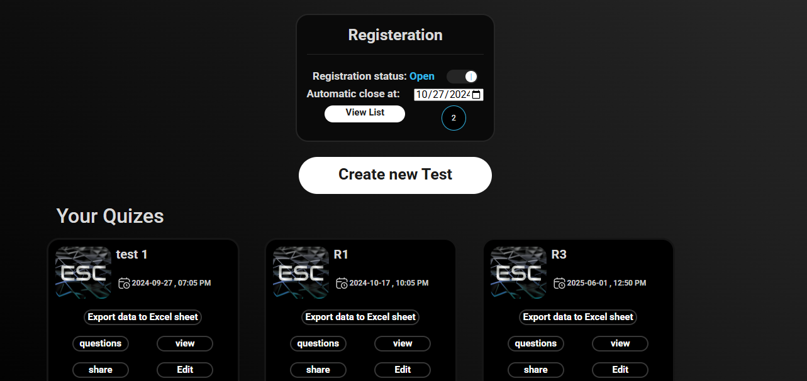
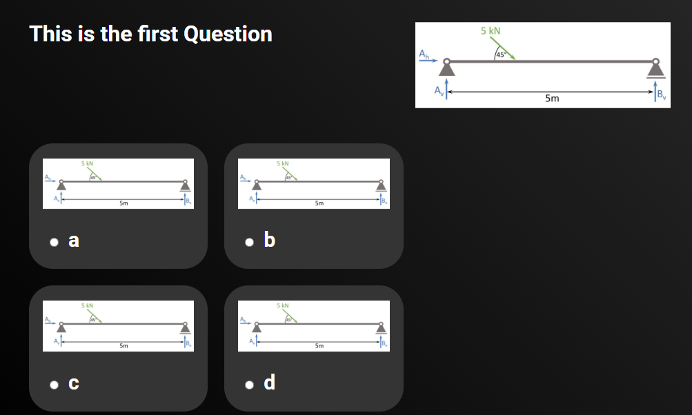
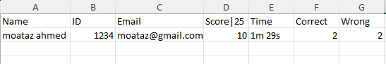
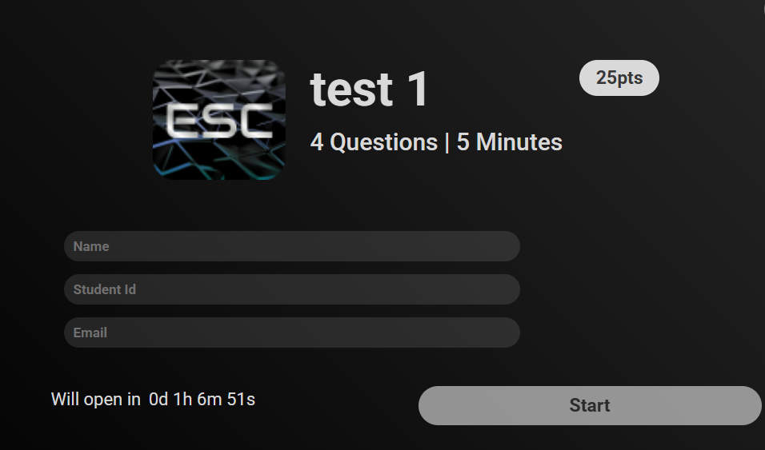
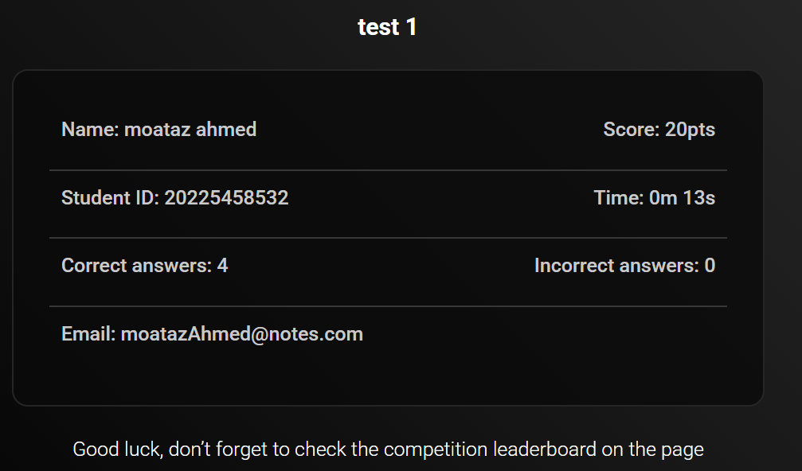

# Compitions and Quizzes System (Laravel)

- This is a Laravel web application for hosting
competitions and quizzes, allowing admins to create
quizzes and students to register, participate, and
receive their results.
_______________________

### Features
* Admin dashboard to manage students and quizzes
* Student registration
* Quiz creating and scheduling
* Automaic correction
* Export results as excel file

_______________________

### Built With
* <b>Backent :</b> Laravel 10
* <b>Frontend :</b> HTML, CSS, Bootstrap 5, JavaScript 
* <b>Database :</b> MySQL

_______________________

### ScreenShots

- Admin dashboard

________________

- Quizz 

________________

- Results

________________

- Test CountDown

________________
________________

- Result

________________

## Installation

- 1- Colne this repository
- 2- composer install
- 3- php artisan migrate 
- 4- php artisan serve

_______________

## Contributions
Contributions, issues, and feature requests are welcome! Feel free to open an issue.
